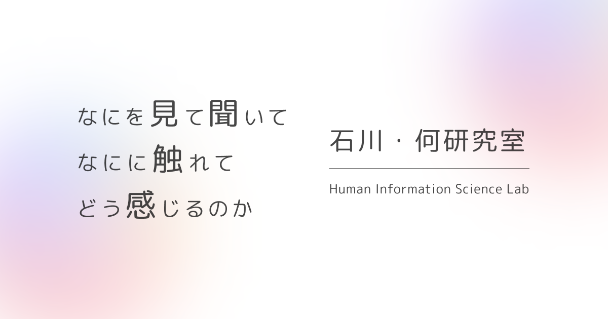
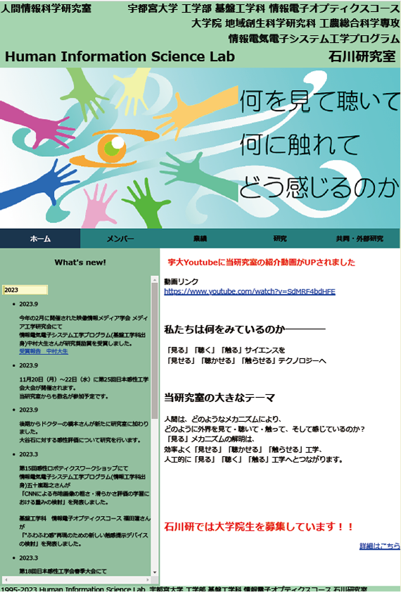
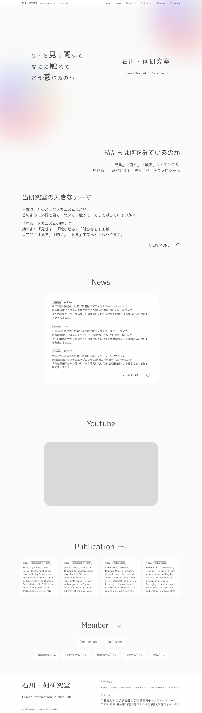
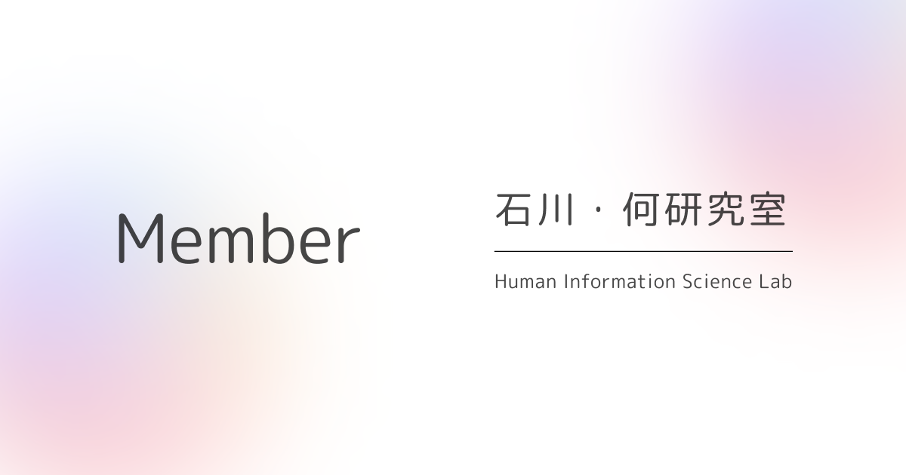
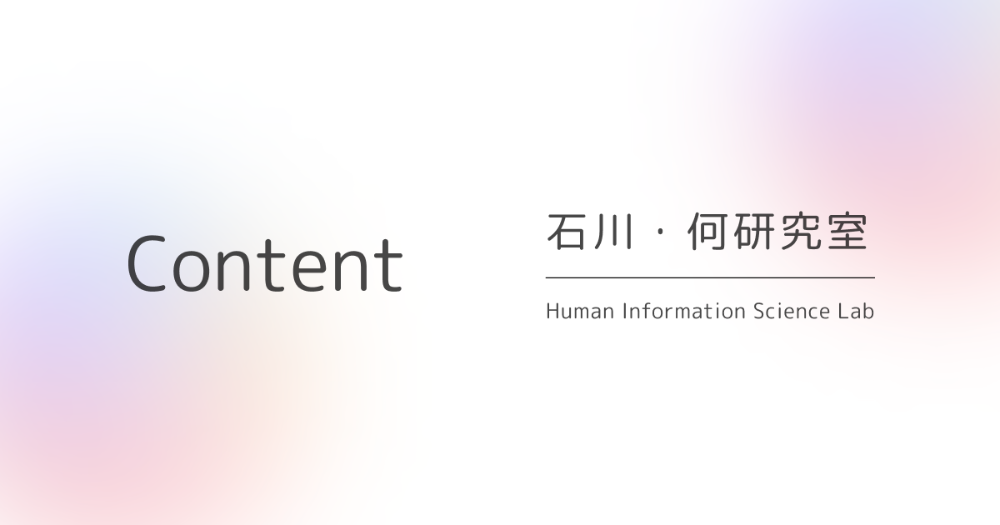
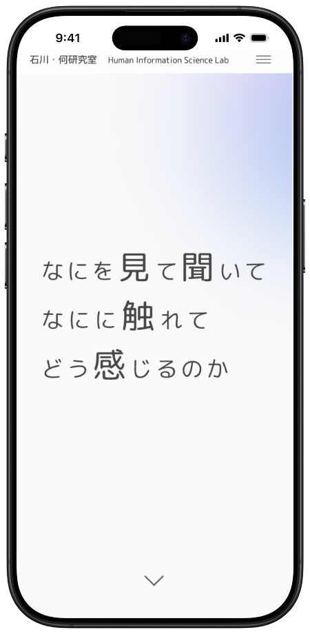
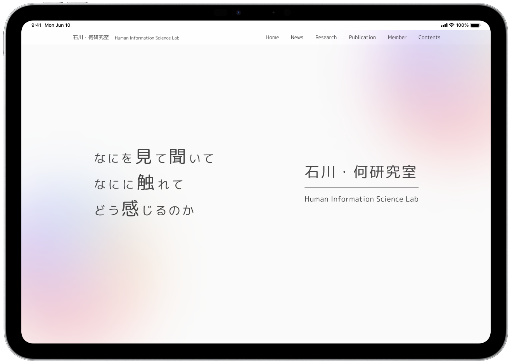

# ishikawa-lab-website
石川・何研究室の公式サイトです。  
2025年に大規模リニューアルリリースを行いました。


# サイトのURL
こちらからご確認いただけます →
[新サイトはこちら](http://www.is.utsunomiya-u.ac.jp/human-information-science-lab/index.html)

## 制作背景
旧サイトでは、デザインの統一性や更新のしやすさに課題がありました。
そこで、より見やすく、更新しやすいサイトを目指してリニューアルしました。

## 旧サイトと新サイトの比較
| 旧サイト | 新サイト |
| -------- | ---------- |
|  |  |

<div>
  <h3>旧サイトの問題点</h3>
  <ul>
    <li>デザインの一貫性がない</li>
    <li>更新者の負荷が大きい
      <ul>
        <li>フォルダ構成が複雑</li>
        <li>情報が分散</li>
        <li>文字化けが多発</li>
      </ul>
    </li>
    <li>レスポンシブ未対応</li>
  </ul>

  <h3>新サイトのポイント</h3>
  <ul>
    <li>デザインの改善</li>
    <li>更新者負担を減らす構成で再設計
      <ul>
        <li>データ(JSON)と見た目(HTML等)の分離</li>
        <li>適切なファイル分割</li>
        <li>更新方法の明確化</li>
        <li>編集者向けドキュメントの整備</li>
      </ul>
    </li>
    <li>レスポンシブ対応(スマホ・タブレット・PC)</li>
  </ul>
</div>

## 使用技術
- HTML / CSS / JavaScript（フロントエンドのみの静的サイト）
- JSONによるデータ管理（ニュース・研究・業績・メンバー情報をJSONでまとめ、各ページで読み込む）
- デザインは Figma で作成([Figma](https://www.figma.com/design/6ZfSHxZCg8mhkg74R0XxKN/ishikawa-lab-website?node-id=576-923&t=mzFruA42YhejmUOL-1))

## データ管理・運用方針
- 各ページは対応するJSONファイルを読み込んで内容を表示
- データはできるだけシンプルに管理し、未来の研究室メンバーが更新しやすい構成とした
- 新しいニュースや受賞情報を追加する場合は、dataフォルダ内のJSONを更新する

## ディレクトリ構成
```text
📁 ishikawa-lab-website
├─ index.html           … サイトTOPページ
├─ news.html            … ニュース情報ページ
├─ research.html        … 研究テーマ・共同研究ページ
├─ publication.html     … 研究業績ページ
├─ member.html          … 研究室メンバーページ
├─ contents.html        … 研究関連コンテンツページ
├─ _header.html         … 共通ヘッダー
├─ _footer.html         … 共通フッター
│
├─ 📁 member
│  ├─ ishikawa.html     … 教授紹介
│  ├─ heyuanyuan.html   … 助教紹介
│  └─ obog.html         … OBOGページ
│
├─ 📁 contents
│  ├─ oyaishi/oyaishi.html    … 大谷石カタログ
│  ├─ recruit/recruit.html    … 大学院生募集ページ
│  └─ award/                  … 受賞関連ページ
│
├─ 📁 images                  … 画像管理（faculty, favicon, ogp, obog, event）
├─ 📁 css                     … スタイルシート
├─ 📁 js                      … スクリプト
└─ 📁 data                    … JSONデータ（news, research, publication, member）
```

## OGP
<div style="display: flex; flex-wrap: wrap; gap: 10px;">
  
  
  
  
  
  
</div>

## ファビコン/アイコン


## モックアップ
<div style="display: flex; gap: 10px;">
    
    
</div>